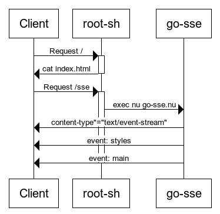

## stream driven development

This branch is an exercise in stream driven development, to see how far we can
go with it. It still feels like a spaghetti mess. It requires five background
processes to facilitate this demonstration. I think we can [continue to refine
this pattern](#path-to-streamline), and make it more ergonomic.

https://github.com/user-attachments/assets/88d8001f-15eb-40fd-bce8-2ae8ee44d513

### How this currently hangs together

Serving the page is done with [http-sh](https://github.com/cablehead/http-sh),

```sh
http-sh :4007 -- ./root.sh
open http://localhost:4007
```

 http sequence diagram" style="width:50%;"/>

This serves two endpoints:

#### `/` - literally [`cat index.html`](https://github.com/cablehead/html-cat/blob/with-xs/root.sh#L22)

index.html uses htmx's SSE extension to fill two placeholders "styles" and "main".

```
<body hx-ext="sse" sse-connect="/sse">
    <style sse-swap="styles">
        /* Initial styles */
    </style>
    <div sse-swap="main">
        Waiting for a SSE "main" event....
    </div>
</body>
```

#### `/sse` - runs the nushell script go-sse.nu

An event stream / bus is provided by [`xs`](https://github.com/cablehead/xs),

```sh
xs ./page
```

go-sse watches the event stream and emits topics prefixed with
`sse/<event-name>` as server sent events.

```
html-cat: curl localhost:4007/sse
event: main
data: <h2>macOS Clipboard Managers</h2>
data:
data: <ul>
data: <li><a href="https://maccy.app">https://maccy.app</a></li>
data: <li><a href="https://www.raycast.com">https://www.raycast.com</a></li>
data: </ul>

event: styles
data: /* nord dark mode */
data:
data: body {
data:   max-width: 800px;
data:   ...
data:
```

#### `source w.nu`

Watches for changes to the files `main.html` and `style.css`.

- on changes to `style.css`: the contents of `style.css` are appended to the
  stream with the topic `sse/styles`
- on changes to `main.html`: the contents of `main.html` are appended to the
  stream with the topic `main.html`

#### `source r2.nu`

Watches the event stream for topics `main.html` and `url`. It maintains a list
of seen urls and on either topic, uses the `minijinja-cli` CLI to render the
template, passing the urls as data for the render. The output of the render is
appended to the stream as `sse/main`.

### Path to streamline

- `xs` has a builtin http server (removes the need for `http-sh`)
- this http server has a convenience to broadcast topics as server sent events
  (removes the need for `go-sse.nu`)
- edit files (main.html and style.css) directly on the event stream (removes
  the need for `source w.nu`)
- ability to register a handler with xs: replaces `source r2.nu`
